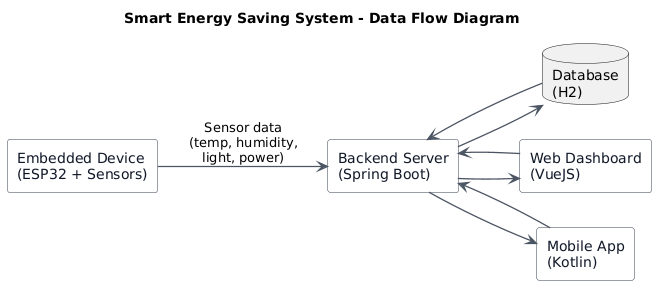
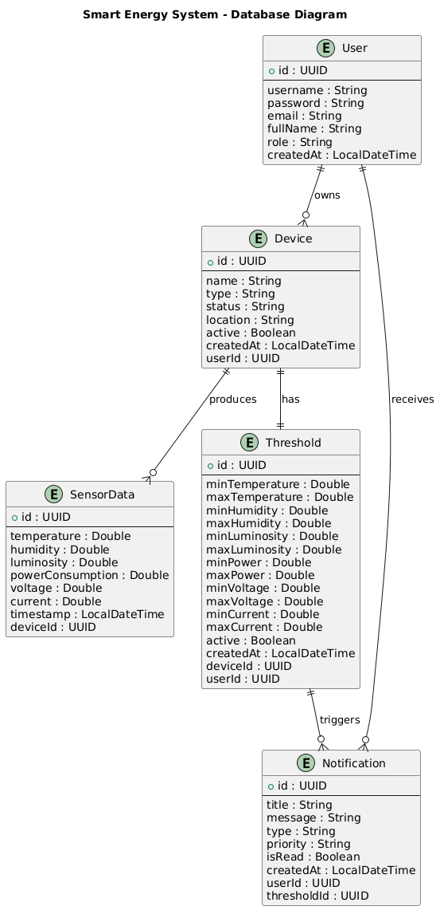

# Smart Energy Saving System

**Programmer:**

Mahdiyeh ANJOMSHOAE
&
Mohammadali RAHIMI

**Project:**
Smart Energy Saving System – S1 M1 CPS2

---

## Project Overview

This project is a complete IoT-based smart energy monitoring system. The system collects energy consumption and environmental data from ESP32 devices, processes it through a Spring Boot backend, and presents it to users via web and mobile applications. Users can monitor their energy usage in real-time, view analytics, and receive energy-saving recommendations.

## 1. Below are some of the conversations we had at the beginning of the project, but after that we will write you detailed details of the project.

### embedded part:

embedded part validated by M. Lefrançois

We will use basic sensors such as:
-Temperature sensor (DHT22) to monitor room temperature and humidity.
-luminosity sensor (temt6000) to detect ambient light for smart lighting.

we will simulate energy consumption using either:

- the potentiometer
- the distance sensor of the bluefuit sense
- some existing power profiles of whitegood found on the web, that we will upload to the micro-sd card, and will "play" on the device

### Web part:

Online dashboard to monitor and analyze electricity consumption (charts, reports, suggestions).Users:

- Homeowners / Energy managers.
  Functionalities:
- Monitor and analyze electricity consumption with charts and reports.
- View suggestions to reduce energy usage.
- Cannot directly control devices (only monitoring).
  Database Data:
- User profiles (login, household info).
- Device IDs and types.
- Energy consumption logs (timestamp, current, voltage, power).
- Suggestions and thresholds.

### Mobile part:

Mobile app for remote control of devices and receiving energy-saving data.Users: Homeowners / Tenants.
Functionalities:

- Remote control of connected devices (turn on/off).
- Receive energy-saving notifications.
- View simplified consumption data.
- Cannot see advanced analytics (web only).

Database Data:

- User profiles and authentication tokens.
- Device status (on/off).
- Notification history.
- Real-time consumption values.

## System

The system consists of four main parts:

### 1. Embedded Device (ESP32)

ESP32 microcontroller with sensors that collect environmental and energy data, then send it to the backend server.

**Technologies:** ESP32, MicroPython, DHT22, TEMT6000, Potentiometer, SD Card

[Full Embedded Documentation](embedded/README.md)

### Backend

Central REST API server that receives data from devices, stores it in database, and serves it to frontend and mobile applications.

**Technologies:** Java 21, Spring Boot 4.0.1, Gradle 8.14, H2 Database, Spring Data JPA

[Full Backend Documentation](backend/README.md)

### Frontend

Dashboard for monitoring and analyzing energy consumption with charts, reports, and energy-saving suggestions.

**Technologies:** VueJS

[Full Frontend Documentation](frontend/README.md)

### 4. Mobile Application

Mobile app for remote monitoring and receiving energy-saving notifications.

**Technologies:** Kotlin

[Full Mobile Documentation](application/README.md)

---

## Data Loop

The system follows this data:

1. **ESP32 Device** → Collects sensor data (temperature, humidity, light, power consumption)
2. **ESP32 Device** → Sends data via wifi http POST to Backend
3. **Backend Server** → Receives data and stores it in H2 Database
4. **Backend Server** → Provides API endpoints for data access
5. **Web Frontend** → Connects to Backend REST API to fetch and display data
6. **Mobile App** → Connects to Backend REST API to fetch and display data



All components communicate through the central backend server. The backend manages the database, handles authentication, and serves data to both web and mobile clients. The ESP32 devices operate independently and send data directly to the backend without requiring the frontend or mobile apps to be running.

---

## Database Structure

while working on this project, we felt that understand the database structure would help grasp the overall system architecture better. The diagram below shows how different entities relate to each other and what data flows through the system



---

## Project Structure

```
smart-energy-system/
├── backend/                    # Spring Boot
├── frontend/                   # VueJS
├── application/                # Kotlin
├── embedded/                   # ESP32 + MicroPython
├── docs/                       # Documentation and images
│   └── images/                 # System diagrams and photos
└── README.md                   # This file
```

---

## Deployment

### Backend Deployment on Render.com

For production deployment and easier demonstration, we deployed the backend on **Render.com** - a cloud platform that provides free hosting for our Spring Boot application.

**Why Render?**

- Free tier with sufficient resources for demonstration
- Automatic deployment from GitHub
- Docker support for consistent environments
- No credit card required for basic usage
- Built-in HTTPS and custom domains

**Deployment Configuration:**

The backend is containerized using Docker to ensure consistency between development and production environments. The deployment configuration is managed through:

- **Dockerfile** (`backend/Dockerfile`):
  - Multi-stage build to optimize image size
  - Uses Gradle 8.14 with JDK 21 for building
  - Final image uses Eclipse Temurin JRE Alpine (lightweight)
  - Application runs on port 8080

**Deployment Process:**

1. Push code to GitHub repository
2. Render automatically detects changes
3. Builds Docker image using the Dockerfile
4. Deploys the container to Render's infrastructure
5. Backend becomes accessible via provided URL (`https://smart-energy-system.onrender.com/swagger-ui.html`)

---

## Start

Each component has its own detailed documentation with setup instructions:

- **Embedded:** See [embedded/README.md](embedded/README.md)
- **Backend:** See [backend/README.md](backend/README.md)
- **Frontend:** See [frontend/README.md](frontend/README.md)
- **Mobile:** See [application/README.md](application/README.md)
