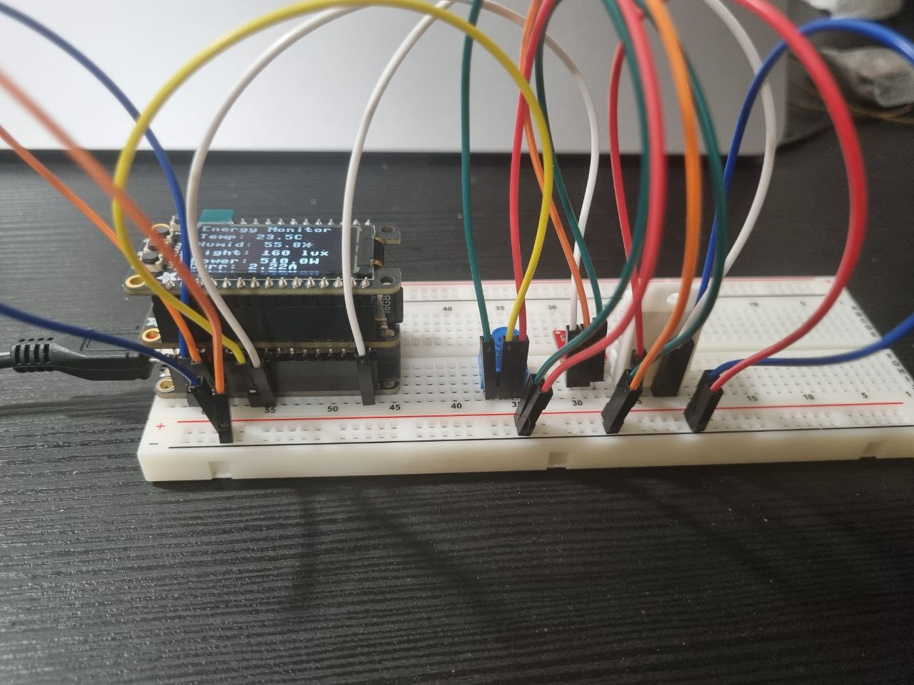
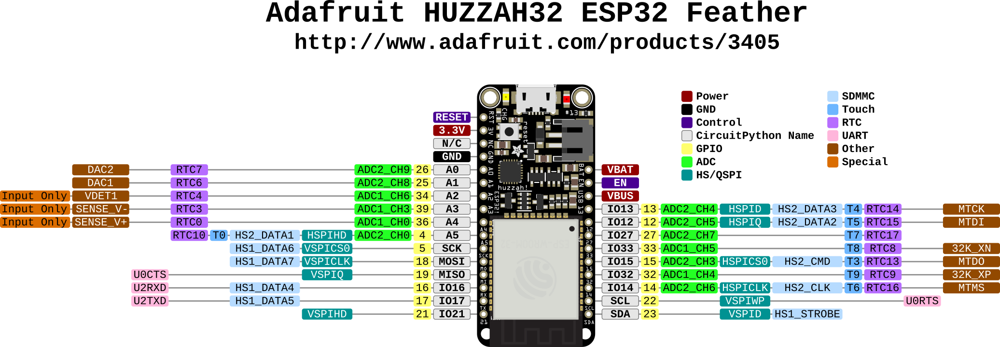

# Smart Energy System - Embedded Device

## Project Overview

This project is a smart energy monitoring system using an ESP32 microcontroller. The device collects environmental data and energy consumption information, sends it to backend server for analysis and visualization.

**embedded part validated by M. Lefrançois**

We will use basic sensors such as:
-Temperature sensor (DHT22) to monitor room temperature and humidity.
-luminosity sensor (temt6000) to detect ambient light for smart lighting.

we will simulate energy consumption using either:

- the potentiometer
- the distance sensor of the bluefuit sense
- some existing power profiles of whitegood found on the web, that we will upload to the micro-sd card, and will "play" on the device

## Planning

During the early planning phase with Professor, we discussed what sensors and components would be needed for a practical energy monitoring system. The professor suggested we focus on basic sensors that are commonly available and easy to work with. We decided to use a temperature sensor ( DHT22 ) to monitor room temperature and humidity, which is important because heating and cooling systems are major energy consumers in most homes. For smart lighting features, we added a luminosity sensor (TEMT6000) that detects ambient light levels.

For simulating energy consumption, the professor gave us several options to choose from. We could use a simple potentiometer for manual control, the distance sensor on a Bluefruit Sense board, or load existing power profiles of household appliances from a micro-SD card. The third option was particularly interesting because it would let us replay realistic consumption patterns of real appliances like washing machines, refrigerators, or air conditioners. After considering all options, we implemented both the potentiometer for manual testing and the SD card system for realistic simulations.

## Hardware

Our hardware setup consists of several key components working together. At the base of the system is the Adafruit HUZZAH32 ESP32 Feather board, it has built-in wifi.

We use a DHT22 sensor connected to GPIO 21 for measuring temperature and humidity. This sensor is reliable and gives accurate readings every few seconds. The TEMT6000 light sensor connects to GPIO 39 (labeled as A3 on the board) and helps us understand the ambient light conditions. For simulating power consumption, we have a potentiometer on GPIO 34 (A2 pin) that lets us manually adjust the simulated power usage from 0 to 3000 watts.

The display system uses an SH1107 oled screen with 128x64 resolution connected via I2C to pins GPIO 22 (SCL) and GPIO 23 (SDA). This screen shows real-time readings so we can see what's happening without connecting to a computer. There's also a built-in red LED on GPIO 13 that blinks to show the device is working and stays on when wifi is connected.

An important addition to our setup is the Adalogger FeatherWing, which sits on top of the ESP32 board and provides SD card storage. This module connects through SPI pins (CS on GPIO 33, SCK on GPIO 5, MOSI on GPIO 18, and MISO on GPIO 19). The SD card lets us store power consumption profiles representing how real appliances use electricity over time. For this project, we created sample data with realistic patterns, though real power profiles from actual appliances can be found on the internet and used instead if needed.

## How System Works

First of all, when you turn it on, it initializes all the hardware parts and displays a startup message on the oled . The system then checks the configuration to see if it should read data from real sensors or from the SD card. This flexibility was important because sometimes we want to test with actual environmental data, and other times we want to demonstrate with consistent, realistic power profiles.

In sensor mode, the ESP32 reads the DHT22 for temperature and humidity, checks the temt6000 for light levels, and reads the potentiometer position to simulate power consumption. The system calculates the current draw based on the power reading and the standard 230V voltage. Every 2 seconds, it updates the oled display with fresh readings so you can see changes in real time.

In SD card mode, the device loads a CSV file containing pre-recorded sensor data and power consumption profiles. This mode is useful for demonstrations because you can show realistic patterns like a washing machine's power usage during a complete wash cycle, or a refrigerator's compressor cycling on and off. The data loops continuously, so the demonstration can run as long as needed.

Regardless of which mode is active, the ESP32 connects to the local wifi network and communicates with our backend server. Every 20 seconds, it packages all the current readings into a JSON payload and sends it via http POST to the backend API. The backend then stores this data in a database and makes it available through the web application for analysis and visualization.

## Software Architecture

The software is organized into clear, modular components that each handle specific responsibilities. We wrote everything in MicroPython.

The main configuration file 'src/config.py' centralizes all the settings. It contains wifi credentials, the backend API URL, the unique device identifier, GPIO pin assignments for all sensors, timing intervals, and the mode selection flag that switches between sensor and SD card operation. Having everything in one place makes it easy to change settings without hunting through the code.

The core program ('src/main.py') contains several important functions. The 'init_hardware()' function sets up the sensors and display, but it checks the mode first - if we're using the SD card, it doesn't initialize the physical sensors since they won't be used. The 'init_sd_card()' and 'load_csv_data()' functions handle mounting the SD card and loading the data file into memory.

Reading data happens through 'read_sensors()', which intelligently switches between reading physical sensors or pulling the next record from the loaded CSV data. The 'display_data()' function formats all the readings nicely on the oled screen, showing temperature, humidity, light level, power consumption, and calculated current. Finally, 'send_to_api()' packages everything into the json format that the backend expects and handles the http communication, including proper error handling and connection cleanup

## Data Flow

The data flows through several stages from collection to storage. First, sensor readings or CSV records are gathered every 2 seconds. These values get displayed on the oled screen immediately so there's always visual feedback. The system accumulates readings and every 20 seconds, it takes the most recent set of values and prepares them for transmission.

The JSON payload sent to the backend includes six data fields: temperature in Celsius, humidity as a percentage, luminosity in lux, power consumption in watts , voltage (always 230V in our case), and current in amperes. It also includes the device ID so the backend knows which device sent the data. This format matches exactly what the backend API expects, which we confirmed by examining the Java data transfer object in the backend code.

Communication happens over http rather than more sophisticated protocols like MQTT. We chose http because it's simple to implement and our backend already has a REST API. The ESP32 connects to the local wifi network on the 2.4GHz band (it doesn't support 5GHz), gets an IP address via DHCP, and then makes POST requests to the backend server . The system handles connection failures gracefully by retrying on the next interval rather than crashing.

## Test files

We created separate test scripts for each component because debugging everything at once is nearly impossible. Each test file focuses on one specific part of the system and provides clear feedback about whether it's working correctly.

- **tests/test_oled.py** - Tests the oled display, scans I2C bus and draws text
- **tests/test_dht22.py** - Tests DHT22 temperature and humidity sensor readings
- **tests/test_light_oled.py** - Tests TEMT6000 light sensor and displays lux value on oled
- **tests/test_pot_oled.py** - Tests potentiometer and shows power level as you turn it
- **tests/test_api_complete.py** - Tests wifi connection and backend API communication
- **tests/test_sd.py** - Tests SD card mounting, reading, and writing files

## Config

The system is designed to be configurable without changing the main code . In 'src/config.py', you can switch between sensor and SD card modes by setting 'USE_SD_CARD' to True or False. When False, the system reads from physical sensors. When True, it loads data from the SD card .

wifi settings are straightforward - just enter your network name and password. The API URL should point to your backend server's IP address and port . Make sure the device ID matches a valid UUID in the backend database, or the backend will reject the data

Pin assignments can be changed if needed, but be careful because not all ESP32 pins work the same way. Some pins are input-only, some don't work with wifi active, and some are used during boot. We carefully selected pins that work reliably for our purposes.
